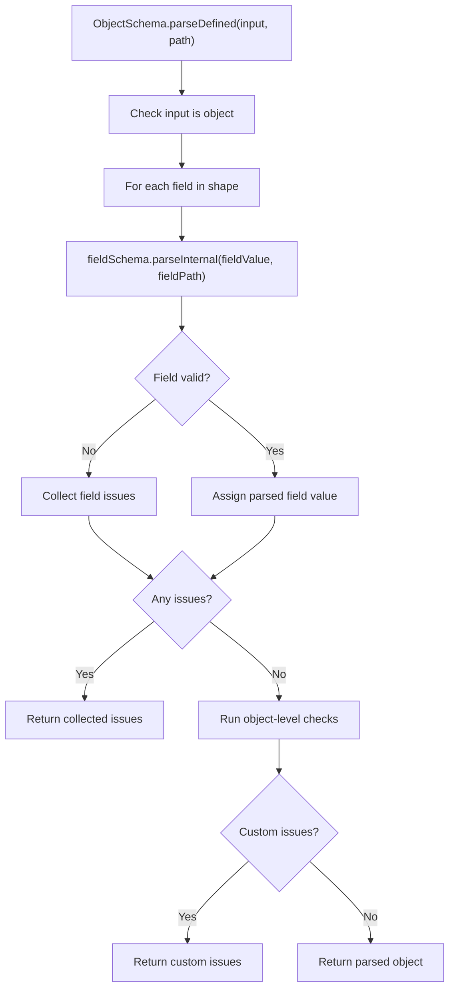
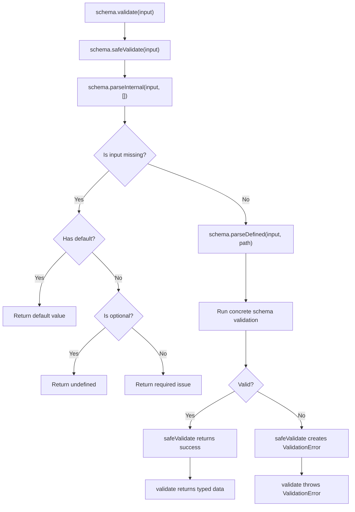
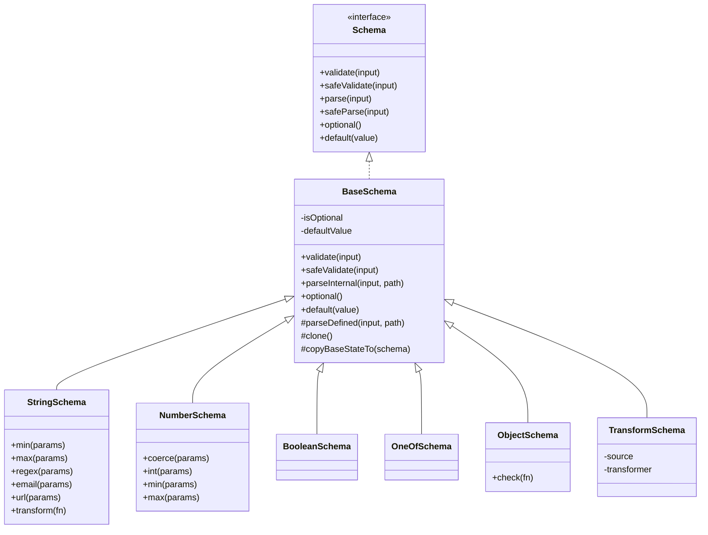

# Internal Validation Flow

This document explains how `@imcauan/validation` builds and executes schemas under
the hood. It is meant for maintainers changing schema internals.

## High-Level Shape

The public API starts at the `v` builder facade:

```ts
const schema = v.object({
  name: v.string({ requiredError: 'name_required' }),
  age: v.number().coerce({ error: 'age_required' }).min({
    value: 18,
    error: 'age_min',
  }),
});
```

Each `v.*` method creates a schema object. Concrete schemas, such as
`StringSchema`, `NumberSchema`, `ObjectSchema`, and `OneOfSchema`, inherit from
`BaseSchema`.

`BaseSchema` owns the shared validation lifecycle:

- `validate(input)`
- `safeValidate(input)`
- `parse(input)`
- `safeParse(input)`
- `optional()`
- `default(value)`

Concrete schemas own type-specific behavior through `parseDefined(...)`.

## Public Validation Methods

`validate` is the throwing API:

```ts
const data = schema.validate(input);
```

Internally it calls `safeValidate`. If the result failed, it throws the
`ValidationError`; otherwise, it returns typed data.

`safeValidate` is the non-throwing API:

```ts
const result = schema.safeValidate(input);
```

It returns either:

```ts
{
  success: (true, data);
}
```

or:

```ts
{
  success: (false, issues, error);
}
```

`safeValidate` is the public boundary that turns internal issues into a
`ValidationError`.

## What `parseInternal(input, [])` Does

`parseInternal` is the internal validation pipeline. The call:

```ts
this.parseInternal(input, []);
```

means:

> Validate this value starting at the root path.

The second argument is the current validation path. At the root, the path is
empty:

```ts
[];
```

Nested object schemas append field names as validation moves deeper:

```ts
root.parseInternal(input, []);
user.parseInternal(input.user, ['user']);
email.parseInternal(input.user.email, ['user', 'email']);
```

This is how issues keep accurate nested paths.

`BaseSchema.parseInternal` does only the shared presence handling:

```ts
parseInternal(input, path) {
  if (this.isMissing(input)) {
    return this.resolveMissingInput(path);
  }

  return this.parseDefined(input, path);
}
```

The shared flow is:

1. Check if the value is missing.
2. If it is missing and `.default(...)` exists, return the default.
3. If it is missing and `.optional()` was used, return `undefined`.
4. If it is missing and neither handler exists, return a required issue.
5. If it is not missing, delegate to the concrete schema through
   `parseDefined(...)`.

## Required, Optional, And Default Values

Values are required by default.

```ts
v.string({ requiredError: 'name_required' });
```

Missing values return a `required` issue unless the schema has `.optional()` or
`.default(...)`.

```ts
v.string().optional().validate(undefined); // undefined
v.string().default('Untitled').validate(undefined); // 'Untitled'
```

Missing value semantics can differ by schema:

- `BaseSchema` treats only `undefined` as missing.
- `StringSchema` treats `undefined` and `''` as missing.
- `NumberSchema` treats `''` as missing when coercion is enabled.

## Concrete Schema Validation

After presence handling, each concrete schema validates defined input.

`StringSchema.parseDefined(...)` checks that the value is a string and then runs
string rules such as `min`, `max`, `regex`, `email`, and `url`.

`NumberSchema.parseDefined(...)` may coerce input, checks that the value is a
valid number, then runs numeric rules such as `int`, `min`, and `max`.

`BooleanSchema.parseDefined(...)` checks that the value is a boolean.

`OneOfSchema.parseDefined(...)` checks that the value is a string included in
the allowed values.

`ObjectSchema.parseDefined(...)` checks that the value is an object, validates
each field schema, collects nested issues, and runs object-level checks after
fields pass.

## Rule Execution

Schema-specific methods add ordered rule functions to a schema.

```ts
v.string()
  .min({ value: 3, error: 'too_short' })
  .max({ value: 20, error: 'too_long' });
```

When a defined value is parsed, the schema runs those rules in order and
collects every issue they return. A valid value produces no issues.

## Why `copyBaseStateTo` Exists

Schema methods such as `.min(...)`, `.max(...)`, `.int(...)`, and `.coerce(...)`
create a cloned schema instance before adding the new rule. This keeps chaining
predictable.

The cloned schema must keep shared base behavior that may already have been
configured:

```ts
v.string().optional().min({ value: 3, error: 'too_short' });
v.string().default('Untitled').max({ value: 50, error: 'too_long' });
```

`copyBaseStateTo` copies that shared base state into the new instance:

- `isOptional`
- `defaultValue`

Without it, a later chain method could accidentally erase `.optional()` or
`.default(...)`.

## Object Schema Flow

Object schemas compose other schemas.



Object-level `.check(...)` runs only after all fields validate successfully.
This gives checks a typed value instead of raw unknown input.

## Transform Schema Flow

`TransformSchema` wraps a source schema and maps its validated output.

```ts
const schema = v.string().transform(value => value.length);
```

The transform flow is:

1. Handle transform-level `.default(...)` or `.optional()` for missing input.
2. Validate input through the source schema.
3. If the source fails, return the source issues unchanged.
4. If the source returns `undefined`, return `undefined` without transforming.
5. Otherwise, run the transformer and return its output.

This keeps source validation responsible for correctness and transform schemas
responsible only for mapping successful values.

## End-To-End Flow



## Class Relationships



## Short Mental Model

- `v` builds schema objects.
- `BaseSchema` controls the shared validation lifecycle.
- `parseInternal(input, path)` runs validation with path awareness.
- `parseDefined(input, path)` is implemented by each concrete schema.
- `ObjectSchema` validates child schemas recursively.
- `TransformSchema` validates through a source schema, then maps successful
  output.
- `safeValidate` returns structured success/failure.
- `validate` throws `ValidationError` on failure.
